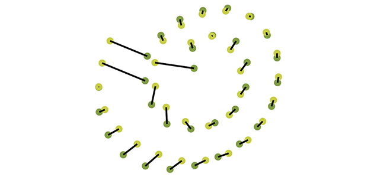

## Overview
Recognize drawn shapes based on their point clouds.

## Installation

    npm install outlines

## Usages

**TODO:** Fill this out.

## Todo

  - [ ] Figure out if we can support scale (already working?, well x/y aren't independent) and rotation invariance
  - [x] Make a demo that shows top guesses as you are drawing
  - [ ] Document the API
  - [ ] Create demos and explanation
    - [ ] Article: Understanding the algorithm, it's limits, extending it (See Rotation Invariance), and work arounds
    - [ ] Demo: Basic flow chart tool with modeless gesture based object and connection interface
      - [ ] Support squares, rectangles,
    - [ ] Demo: Rotation invariance and auto complete on the screen (some of this will be figured out from flowchart tool)
    - [ ] Demo: Dynamic Drawing (Bret Victor) style sequencer?
    - [ ] Demo: Extendible system like Chalk Talk (Ken Perlin)?
    - Auto draw that is extendible would be cool, see: http://www.wired.com/2015/10/microsofts-badass-new-tool-is-like-autocomplete-for-drawing/

## References
  - Based on the **$P Point-Cloud Recognizer** research paper
    - [$P project page](http://depts.washington.edu/aimgroup/proj/dollar/pdollar.html)
    - [PDF of paper](http://faculty.washington.edu/wobbrock/pubs/icmi-12.pdf)
    - [Pseudo Code](http://depts.washington.edu/aimgroup/proj/dollar/pdollar.pdf)
